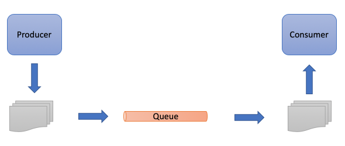

# Spring Boot and Apache ActiveMQ Artemis demo
[//]: # (logo here)



## Table of Contents
* [About the Project](#about-the-project)
  * [Built With](#built-with)
* [Getting Started](#getting-started)
  * [Prerequisites](#prerequisites)
  * [Installation](#installation)
* [Usage](#usage)
* [Clean up](#clean-up)


## About the project
This demo shows how two [Spring Boot](https://spring.io/projects/spring-boot) applications produce and consumes messages 
with [Apache ActiveMQ Artemis](http://activemq.apache.org/components/artemis/) message broker.  

### Built with
* Spring Boot v2.1.4

## Getting started
I have a MacBook Pro and will recommend any Unix-type OS for this exercise.
I also recommend using [sdkman](https://sdkman.io) for easy install and switching between different Java and Maven versions.

Windows users probably know their own way around so I will not go into any details for windows installation.

### Prerequisites
* Git
* Java 8+
* Maven 3.2+
* Docker


### Installation

You will need two separate terminals to run both applications.

Now start the first terminal.

#### Clone this repo
Go to your projects directory and clone the project.
```
git clone https://github.com/Avec112/spring-boot-activemq-artemis-demo.git
```

## Usage

* Start Artemis (docker container)
* Start the Consumer application (consumed messages will be printed to stdout)
* Start the Producer application (it will produce messages at startup)

### Start docker container (Artemis)
In either terminal, start the container containing Artemis.  
We are running the container with in [detached](https://docs.docker.com/engine/reference/run/#detached--d) (-d) mode.  
```
> docker run -it --rm -d \
   -e ARTEMIS_USERNAME=admin \
   -e ARTEMIS_PASSWORD=admin \
   -p 8161:8161 \
   -p 61616:61616 \
   vromero/activemq-artemis:latest-alpine
```
See [documentation](https://github.com/vromero/activemq-artemis-docker) for further information about the Apache ActiveMQ Artemis Docker container configuration.

:information_source: You can verify that Artemis is up by accessing the url http://localhost:8161 (admin/admin)

#### Start Producer application
Open the Producer terminal and start Producer application.   
Messages will be produced and the application will then terminate.  
**Watch the consumer shell for messages when running this command!**
```
> cd spring-boot-activemq-artemis-demo/producer
> mvn spring-boot:run
```
Or you can start the application like this.

But first package jar with dependencies.  
```          
> mvn package
```
Then
```
> java -jar target/producer-0.1.0-SNAPSHOT.jar
```
The application will produce messages and print to output like this.
```
Produced 100 messages.
Produced 200 messages.
Produced 300 messages.
Produced 400 messages.
Produced 500 messages.
Produced 600 messages.
Produced 700 messages.
Produced 800 messages.
Produced 900 messages.
Produced 1000 messages.
Finished creating messages.
```
#### Start Consumer application
Go to Consumer terminal and start the Consumer application.   
It will start listening for new messages. 
```
> cd ./spring-boot-activemq-artemis-demo/consumer
> mvn spring-boot:run
```
*Or you can start the application like this.*  

But first package jar with dependencies.
```
> mvn package
```
Then
```
> java -jar target/consumer-0.1.0-SNAPSHOT.jar
```
The application will consume messages and print to output like this.
```
Listening for messages. CTRL + C to quit.
100 messages processed.
200 messages processed.
300 messages processed.
400 messages processed.
500 messages processed.
600 messages processed.
700 messages processed.
800 messages processed.
900 messages processed.
1000 messages processed.
```

## Clean up
### Stop docker container (Artemis)
List running containers to find the correct ID for Artemis.
```
> docker ps
```
Stop the container by providing ID or NAME.
```
> docker stop [container id or name]
```

### Remove docker image (Artemis)
List images to find the correct ID for Artemis.
```
> docker images
```
Remove the image.
```
> docker rmi [image id]
```
